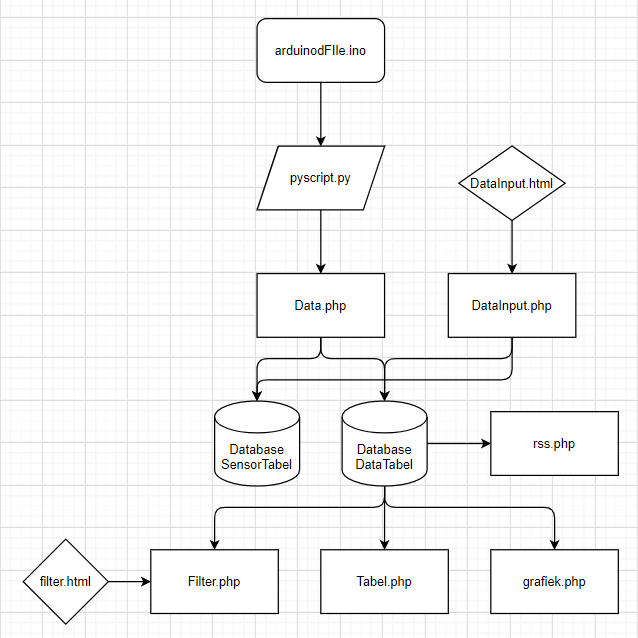

# IoT
Dit is mijn(Pieter Brouns) IoT repository voor de weekly commits.
De data wordt uitgelezen met de arduinoFile.ino(https://github.com/pieterbro05/IoT/blob/main/arduinoFile.ino), dit bestand is geupload op een arduino Uno die aangesloten is aan twee sensoren, één voor de temperatuur en één voor de lichtintensiteit. Het arduino bestand stuurt de data door via de seriële poort, dit kan uitgelezen met het pyscript.py(https://github.com/pieterbro05/IoT/blob/main/pyscript.py), die de data doorstuurt naar het bestand Data.php(https://github.com/pieterbro05/IoT/blob/main/Data.php) die op de server van de school staat. Het Data.php file upload de ontvangen data naar de databases en stuurt alles naar DataTabel en update de laatst ontvangen data naar SensorTabel. Een andere manier om waardes toe te voegen aan de Database, is met behulp van DataInput.html(https://11903162.pxl-ea-ict.be/DataInput.html). Deze html pagina stuurt de ingegeven waardes naar DataInput.php(https://11903162.pxl-ea-ict.be/DataInput.php), die de data in DataTabel en SensorTabel zet. De waarden van DataTabel worden gebruikt door verschillende bestanden. rss.php(https://11903162.pxl-ea-ict.be/rss.php) gebruikt de data voor het gemiddelde, het maximum, het minimum en de laatste waarde van beide sensoren weer te geven. grafiek.php(https://11903162.pxl-ea-ict.be/grafiek.php) gebruikt de data om grafieken weer te geven met behulp van jQuery van de twee sensoren. Tabel.php(https://11903162.pxl-ea-ict.be/Tabel.php) geeft alle waardes weer in een tabel en kan gesorteerd met Filter.php(https://11903162.pxl-ea-ict.be/Filter.php), die de ingegeven waardes van filter.html(https://11903162.pxl-ea-ict.be/filter.html) gebruikt en hierin weergegeven wordt met AJAX.

